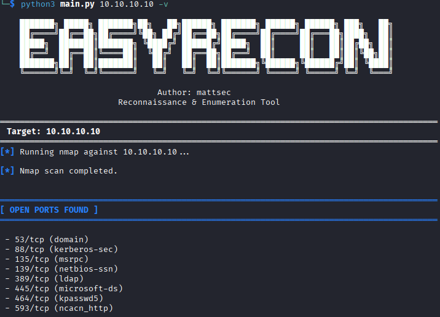
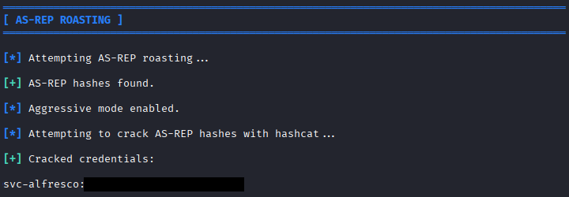

# EasyRecon

**EasyRecon** is a reconnaissance and enumeration framework designed for security testing and penetration testing engagements.

The tool automates common reconnaissance workflows across both **web services and Active Directory environments**, helping testers quickly identify exposed services, enumerate users and discover potential attack vectors.

EasyRecon integrates multiple industry standard security tools and chains enumeration techniques together to streamline the early stages of a penetration test.

---

# Disclaimer

This tool is intended for **educational use and authorised penetration testing only**.  
Do not use this tool against systems without explicit permission.

The author is **not responsible for misuse or damage** caused by this software.

---

# Requirements

EasyRecon relies on several Python libraries and external security utilities.

## Python

- Python **3.10+**  

Install required Python libraries:

```bash
pip install -r requirements.txt
```

## External Tools

Some modules rely on external utilities commonly used in penetration testing environments.

```bash
nmap
feroxbuster
ffuf
curl
grpcurl
python3
python3-pip
pipx
git
git-dumper
CrackMapExec
smbclient
impacket
ldapsearch
rpcclient
```

These tools should be available in your system PATH for full functionality.

---

# Features

EasyRecon is built around a **modular enumeration pipeline**, allowing different modules to run based on detected services.

## Web Enumeration

- TCP port scanning with service detection
- SSL certificate hostname extraction
- Technology stack detection (Apache, Nginx, PHP, WordPress, etc.)
- HTTP header analysis
- Subdomain enumeration using host header wordlists
- Virtual host fuzzing
- Directory brute-forcing using **feroxbuster**
- Detection and dumping of exposed **/.git repositories** using `git-dumper`

## Active Directory Enumeration

- SMB anonymous bind attempt
- SMB share mapping and **RID cycling with user extraction**
- LDAP anonymous bind attempt and **Active Directory user enumeration**
- RPC anonymous connection attempt with `enumdomusers` enumeration
- FTP anonymous connection attempt and **analysis of accessible files**
- AS-REP roasting and optional hash cracking with `--aggressive`

## Network Enumeration

- NFS enumeration and file mounting for further analysis  
- gRPC service enumeration using `grpcurl`

---

# Installation

Clone the repository:

```bash
git clone https://github.com/ZERZZ/easyRecon.git
```

Navigate to the project directory:

```bash
cd easyRecon
```

Install Python dependencies:

```bash
pip install -r requirements.txt
```

Ensure the required external tools are installed on your system.

---

# Usage

### Basic scan

```bash
python3 main.py <target>
```
### Options

```bash
-o <module>      Run a specific module (e.g. smbenum)
-v               Enable verbose output
--aggressive     Attempt to crack discovered AS‑REP hashes automatically
```

### Example
```bash
python3 main.py 10.10.10.10 -o smbenum -v
```

### Full command syntax:

```bash
python3 main.py <target> [-o all|portscan|dirbuster|vhostenum|subdomains|techstack|smbenum|ldapenum|rpcenum|ftpenum|nfsenum] [-v] [--aggressive]
```

---

# Example

Run SMB enumeration with verbose output:

```bash
python3 main.py 10.10.10.10 -o smbenum -v
```

# Example Outputs

### Service Discovery

EasyRecon begins by scanning the target and identifying open services.  
Based on discovered services, relevant enumeration modules are triggered automatically.



---

### AS-REP Roasting
Example of EasyRecon automatically performing AS‑REP roasting after discovering domain users.  
When `--aggressive` is enabled, EasyRecon will attempt to crack discovered hashes using `hashcat`.

 

---

# Future Improvements

Potential future enhancements for EasyRecon include:

- Additional Active Directory attack techniques
- Better parsing and analysis of data 
- Improved output reporting
- Additional service enumeration modules