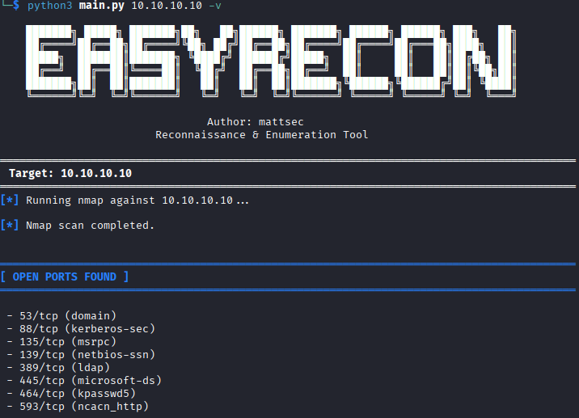
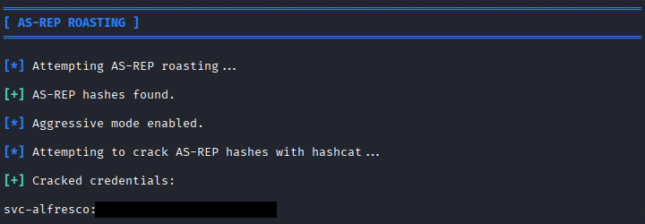

# EasyRecon

**EasyRecon** is a reconnaissance and enumeration framework designed for security testing and penetration testing engagements.

The tool automates common reconnaissance workflows across both **web services and Active Directory environments**, helping testers quickly identify exposed services, enumerate users and discover potential attack vectors.

EasyRecon integrates multiple industry standard security tools and chains enumeration techniques together to streamline the early stages of a penetration test.

---


# Disclaimer

This tool is intended for **educational use and authorised penetration testing only**.  
Do not use this tool against systems without explicit permission.

The author is **not responsible for misuse or damage** caused by this software.

---


# Requirements

EasyRecon relies on several Python libraries and external security utilities.

## Python

- Python **3.10+**  

Install required Python libraries:

```bash
pip install -r requirements.txt
```

## External Tools

Some modules rely on external utilities commonly used in penetration testing environments.

```bash
nmap
feroxbuster
ffuf
curl
grpcurl
python3
python3-pip
pipx
git
git-dumper
CrackMapExec
smbclient
impacket
ldapsearch
rpcclient
searchsploit
ollama
[RustScan (recommended/optional)](https://github.com/bee-san/RustScan/releases)
NetExec
bloodhound-python
certipy-ad
dig
```

These tools should be available in your system PATH for full functionality.

## AI Analysis (Experimental)

EasyRecon includes an **optional AI-assisted analysis module** designed to help interpret reconnaissance data and highlight potentially interesting findings. 

### Setup

Install Ollama:

```bash
curl -fsSL https://ollama.com/install.sh | sh
```

Pull a supported model:

```bash
ollama pull phi3
```

### Important Disclaimer

This feature is **experimental and should not be relied upon for accuracy**.

- Output may be **incorrect, incomplete, or misleading**
- It may produce **false positives or miss critical vulnerabilities**
- It does **not replace manual analysis or professional judgement**

All findings must be **manually verified** before use in any report or engagement.

---


# Features

EasyRecon is built around a **modular enumeration pipeline**, allowing different modules to automatically execute based on detected services. 

## Web Enumeration

- TCP port scanning with service detection
- SSL certificate hostname extraction
- DNS enumeration using `dig` (PTR, AXFR, NS/MX records, subdomain/domain enum)
- Technology stack detection using Wappalyzer / sourcecode / headers inspection 
- Identified technologies mapped to known vulnerabilities and potential exploits
- HTTP header analysis
- Subdomain enumeration using host header wordlists
- Virtual host fuzzing
- Directory brute-forcing using **feroxbuster**
- Detection and dumping of exposed **/.git repositories** using `git-dumper`

## Active Directory Enumeration

- SMB anonymous bind attempt
- SMB share mapping and **RID cycling with user extraction**
- LDAP anonymous bind attempt and **Active Directory user enumeration**
- RPC anonymous connection attempt with `enumdomusers` enumeration
- FTP anonymous connection attempt and **analysis of accessible files**
- AS-REP roasting and optional hash cracking with `--aggressive`
- MSSQL authenticated enumeration and analysis using `NetExec / Impacket`
- BloodHound AD graph collection and automated attack path analysis
- Vulnerable certificate check with `Certipy-AD`

## Network Enumeration

- NFS enumeration and file mounting for further analysis  
- gRPC service enumeration using `grpcurl`

## AI Analysis (Experimental)

- Optional AI-assisted analysis to help interpret reconnaissance output and highlight interesting findings

## Output System

EasyRecon now generates a structured `recon.json` file post-scan and a high level summary.

This file contains:
- Open ports and detected services
- Discovered subdomains
- Web endpoints
- Credentials 
- Structured findings (vulnerabilities, misconfigurations, etc.)

This enables:
- Post-scan analysis
- AI-assisted summarisation
- External parsing / automation

---


# Installation

Clone the repository:

```bash
git clone https://github.com/ZERZZ/easyRecon.git
```

Navigate to the project directory:

```bash
cd easyRecon
```

Install Python dependencies:

```bash
pip install -r requirements.txt
```

Ensure the required external tools are installed on your system.

---


# Usage

### Basic scan

```bash
python3 main.py <target>
```
### Options

```bash
--only <module>      Run a specific module (e.g. smbenum)
-v               Enable verbose output
--aggressive     Attempt to crack discovered AS‑REP hashes automatically
--output-name    Choose a name for the output file
--dev            Skip initial port scan and load from scan.xml
```

### Example
```bash
python3 main.py 10.10.10.10 --only smbenum -v
```

### Full command syntax:

```bash
python3 main.py <target> [--only all|portscan|dnsenum|dirbuster|vhostenum|subdomains|techstack|smbenum|ldapenum|rpcenum|ftpenum|nfsenum] [-v] [--aggressive] [-ai] [--dev] [--output-name]
```

---


# Example

Run SMB enumeration with verbose output:

```bash
python3 main.py 10.10.10.10 --only smbenum -v
```

# Example Outputs

### Service Discovery

EasyRecon begins by scanning the target and identifying open services.  
Based on discovered services, relevant enumeration modules are triggered automatically.



---

### AS-REP Roasting
Example of EasyRecon automatically performing AS‑REP roasting after discovering domain users.  
When `--aggressive` is enabled, EasyRecon will attempt to crack discovered hashes using `hashcat`.

 

---

# Future Improvements

Potential future enhancements for EasyRecon include:

- Additional Active Directory attack techniques 
- Improved AI-assisted analysis and reduction of noisy output 
- Improved CVE lookup / suggestions, less noise 
- Improved bloodhound json analysis / attack path suggestion  
- Improved output reporting 
- Additional service enumeration modules 
- Packaged into easyrecon, maybe PyPI in future 